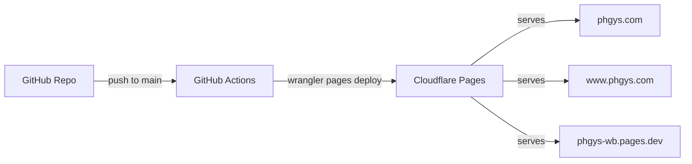
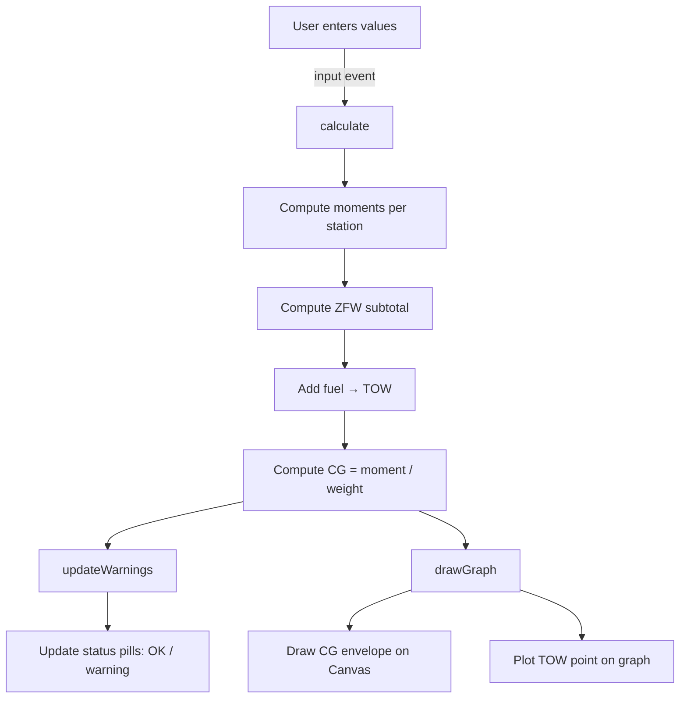

# Architecture

## Overview

The PH-GYS Weight & Balance Calculator is a static single-page application with no backend, no framework, and no build step. All logic runs client-side in the browser.



## File Structure

```
phgys-wb/
├── index.html              # Single HTML page (calculator + graph + PIC block)
├── style.css               # SVS-branded stylesheet (responsive + print)
├── app.js                  # All logic: calculations, graph, i18n, validation
├── .github/
│   └── workflows/
│       └── deploy.yml      # Auto-deploy to Cloudflare Pages on push
└── docs/
    ├── architecture.md     # This file
    ├── aircraft-data.md    # PH-GYS specific W&B data and sources
    └── plans/              # Original design and implementation plans
```

## Technology Stack

| Layer | Technology | Cost |
|---|---|---|
| Frontend | Vanilla HTML/CSS/JS | - |
| Graph | HTML Canvas API | - |
| Hosting | Cloudflare Pages (free tier) | Free |
| CI/CD | GitHub Actions | Free |
| DNS/SSL | Cloudflare (free tier) | Free |

## Application Flow



## Key Components

### Calculation Engine (app.js)

The `AIRCRAFT` constant holds all type-specific data (empty weight, station arms, CG limits). The `calculate()` function runs on every input change and:

1. Reads all input values (5 fields: pilot, rear, bag1, bag2, fuel)
2. Converts fuel liters to kg (x 0.72)
3. Computes moment per row (weight x arm)
4. Derives subtotals (ZFW, TOW) with CG
5. Updates all DOM elements
6. Calls `updateWarnings()` and `drawGraph()`

### CG Envelope Graph (Canvas)

Draws a Weight vs Moment chart with:
- Normal Category envelope (filled polygon)
- Utility Category envelope (dashed)
- Takeoff Weight point (blue, turns red if outside)

The envelope polygon coordinates are derived from CG limits:
- moment = weight x CG_limit

### Bilingual Support (i18n)

A `TRANSLATIONS` object holds all NL/EN strings. `setLanguage()` updates all elements with `data-i18n` attributes. Language preference persists in `localStorage`.

### Print Layout

`@media print` CSS compresses everything to 1 A4 page. The canvas is converted to an `` via `toDataURL()` before printing (Canvas elements don't always render in print). A PIC signature block with auto-filled date/time is shown only in print.

### Validation

Checks weight limits (MTOW, baggage), fuel limits, and CG envelope bounds. Displays green "OK" or red warning pills. Input fields get a red border when exceeding their limit.
