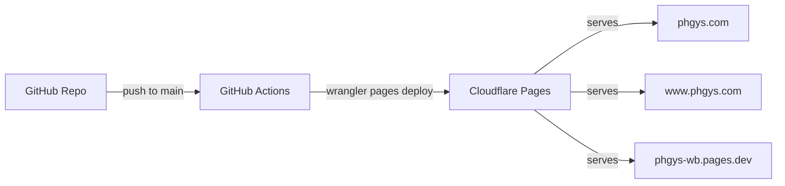
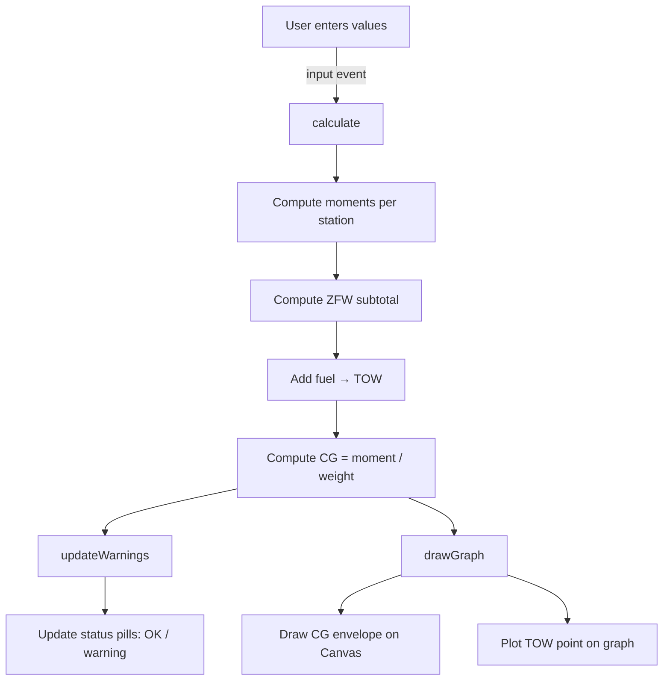
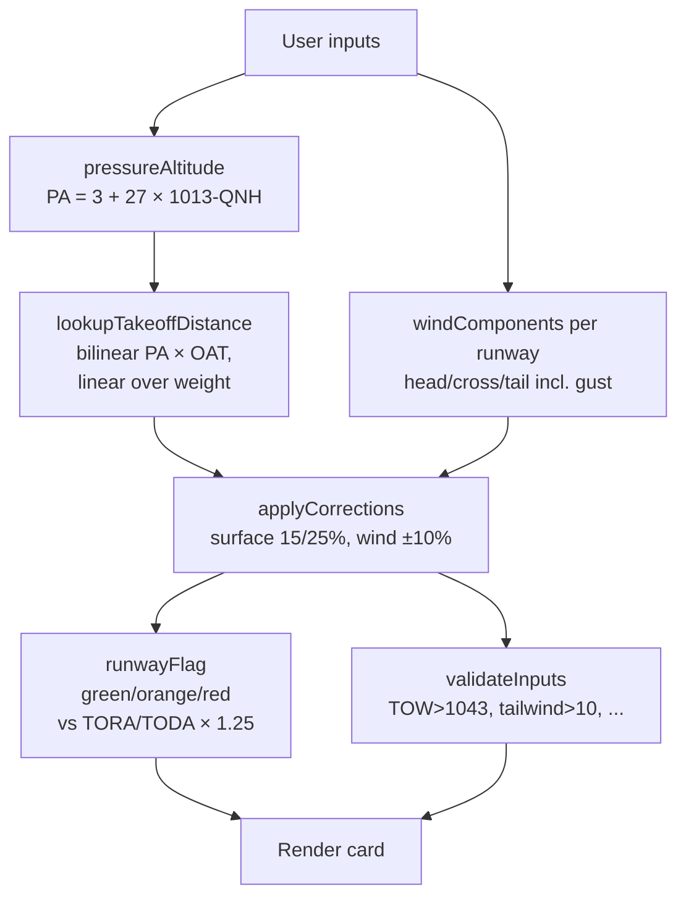

# Architecture

## Overview

The PH-GYS Weight & Balance Calculator is a static single-page application with no backend, no framework, and no build step. All logic runs client-side in the browser.



## File Structure

```
phgys-wb/
├── index.html              # W&B calculator (graph + PIC block)
├── takeoff.html            # Takeoff distance calculator for EHHV
├── takeoff-tables.html     # Printable POH reference tables
├── style.css               # SVS-branded stylesheet (responsive + print)
├── app.js                  # W&B logic: calculations, graph, i18n, validation
├── takeoff.js              # Takeoff page DOM controller (ES module)
├── takeoff-calc.js         # Pure calc functions (PA, wind, lookup, corrections)
├── takeoff-data.js         # POH tables (862/953/1043 kg) + EHHV runways
├── takeoff-tables.js       # Renders POH tables on the reference page
├── takeoff-calc.test.js    # node --test suite for calc functions
├── takeoff-data.test.js    # node --test suite for POH data integrity
├── package.json            # { "type": "module" } — enables ESM in node --test
├── .github/
│   └── workflows/
│       └── deploy.yml      # Auto-deploy to Cloudflare Pages on push
└── docs/
    ├── architecture.md                      # This file
    ├── aircraft-data.md                     # PH-GYS W&B data and sources
    ├── deployment.md                        # CI/CD setup
    ├── soft_field_takeoff_distance.csv      # Source CSV for POH tables
    ├── EHHV/                                # AIP charts and procedures
    └── plans/                               # Design and implementation plans
```

## Technology Stack

| Layer | Technology | Cost |
|---|---|---|
| Frontend | Vanilla HTML/CSS/JS | - |
| Graph | HTML Canvas API | - |
| Hosting | Cloudflare Pages (free tier) | Free |
| CI/CD | GitHub Actions | Free |
| DNS/SSL | Cloudflare (free tier) | Free |

## Application Flow



## Key Components

### Calculation Engine (app.js)

The `AIRCRAFT` constant holds all type-specific data (empty weight, station arms, CG limits). The `calculate()` function runs on every input change and:

1. Reads all input values (5 fields: pilot, rear, bag1, bag2, fuel)
2. Converts fuel liters to kg (x 0.72)
3. Computes moment per row (weight x arm)
4. Derives subtotals (ZFW, TOW) with CG
5. Updates all DOM elements
6. Calls `updateWarnings()` and `drawGraph()`

### CG Envelope Graph (Canvas)

Draws a Weight vs Moment chart with:
- Normal Category envelope (filled polygon)
- Utility Category envelope (dashed)
- Takeoff Weight point (blue, turns red if outside)

The envelope polygon coordinates are derived from CG limits:
- moment = weight x CG_limit

### Bilingual Support (i18n)

A `TRANSLATIONS` object holds all NL/EN strings. `setLanguage()` updates all elements with `data-i18n` attributes. Language preference persists in `localStorage`.

### Print Layout

`@media print` CSS compresses everything to 1 A4 page. The canvas is converted to an `` via `toDataURL()` before printing (Canvas elements don't always render in print). A PIC signature block with auto-filled date/time is shown only in print.

### Validation

Checks weight limits (MTOW, baggage), fuel limits, and CG envelope bounds. Displays green "OK" or red warning pills. Input fields get a red border when exceeding their limit.

## Takeoff Distance Calculator

The `/takeoff.html` page is a separate companion to W&B. It uses ES modules:

- `takeoff-calc.js` — pure functions (PA, wind components, POH bilinear lookup, surface/wind corrections, runway flag, input validation). No DOM, no globals — fully unit-tested under `node --test`.
- `takeoff-data.js` — static POH tables (3 weights × 9 PA × 5 OAT) and EHHV runway constants (true bearing, TORA, TODA per AIP EHHV AD 2.13).
- `takeoff.js` — DOM controller. Reads inputs, calls the calc functions, renders runway cards with mini compass charts, manages the click-to-enlarge modal.

### Calculation flow



### Bridge from W&B

When `calculate()` runs on `/`, it writes the computed TOW (and the W&B input values) to `sessionStorage`. The takeoff page reads `phgys-tow` on load and pre-fills the TOW field. Returning to the W&B page restores the saved inputs so a round-trip preserves your entries.

### Tests

`takeoff-calc.test.js` and `takeoff-data.test.js` run under `node --test` (built-in, requires Node ≥ 18, no npm install). The data tests catch transcription errors via shape, corner-cell, and monotonicity assertions across PA, OAT, and weight.

```bash
node --test     # 33 tests as of last commit
```
