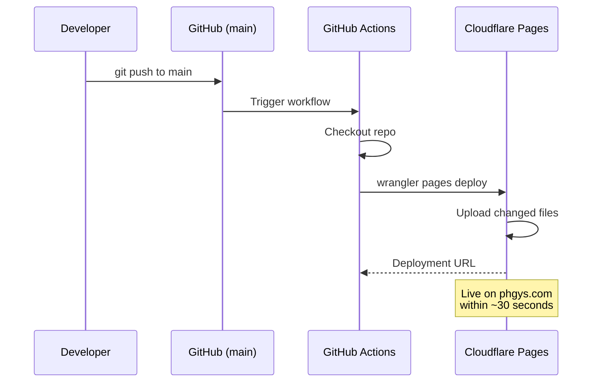

# Deployment

## How It Works



## Automatic Deployment

Every push to `main` triggers a GitHub Actions workflow (`.github/workflows/deploy.yml`) that:

1. Checks out the repository
2. Runs `wrangler pages deploy` with the Cloudflare API token
3. Uploads only changed files to Cloudflare Pages

Deployments typically complete in under 30 seconds.

## Manual Deployment

If needed, deploy manually from the project root:

```bash
npx wrangler pages deploy . --project-name=phgys-wb --branch=main
```

Requires `CLOUDFLARE_API_TOKEN` and `CLOUDFLARE_ACCOUNT_ID` environment variables, or interactive login via `npx wrangler login`.

## Domains

| URL | Type |
|---|---|
| https://phgys.com | Apex domain (CNAME flattening) |
| https://www.phgys.com | WWW subdomain |
| https://phgys-wb.pages.dev | Cloudflare Pages default |

All domains point to the same deployment. Cloudflare handles SSL automatically.

## GitHub Secrets

The following secrets are configured in the GitHub repository (Settings > Secrets and variables > Actions):

| Secret | Purpose |
|---|---|
| `CLOUDFLARE_ACCOUNT_ID` | Cloudflare account identifier |
| `CLOUDFLARE_API_TOKEN` | API token with "Edit Cloudflare Workers" permission |

## Updating the Site

1. Make changes to `index.html`, `style.css`, or `app.js`
2. Commit and push to `main`
3. Wait ~30 seconds for auto-deploy
4. Hard refresh the site (Cmd+Shift+R) if cached

## Updating Aircraft Data

If PH-GYS aircraft data changes (e.g., new weighing, equipment change):

1. Update the `AIRCRAFT` constant in `app.js` (empty weight, arm, moment)
2. Update `docs/aircraft-data.md` with new values and source
3. Commit, push, auto-deploys
